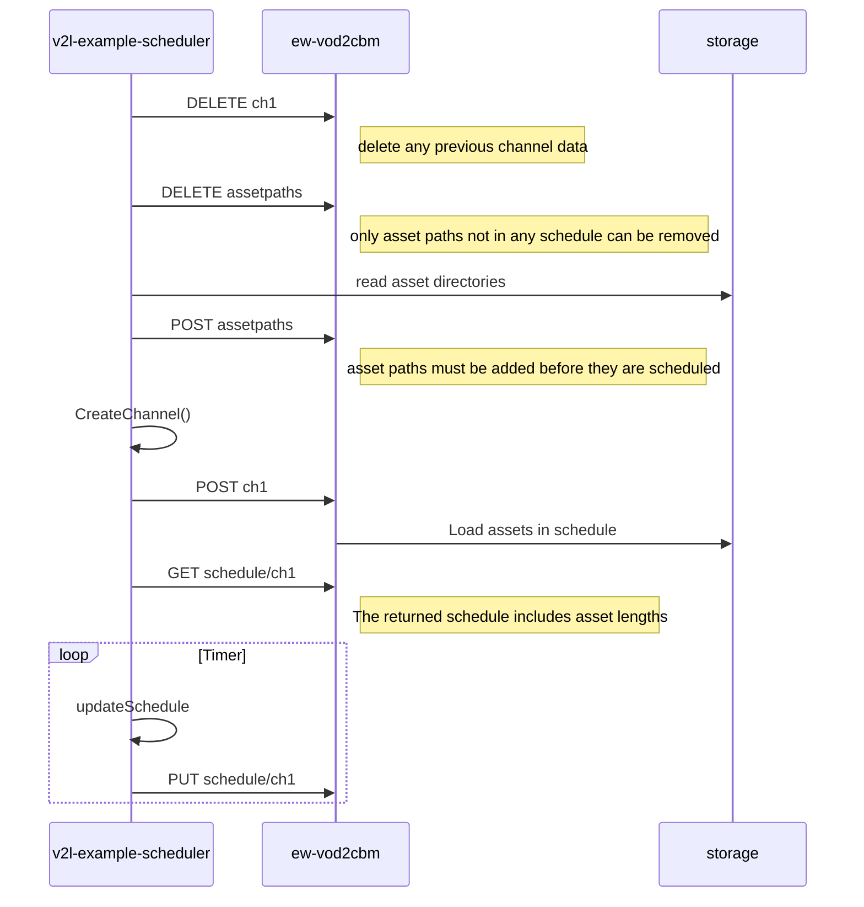

# v2l-example-scheduler

This is a simple example scheduler to show how the 
Agile Content/Edgeware ESB-3019 `ew-vod2cbm` service
can be controlled via its REST API.

The scheduler makes an initial channel, and then adds new assets
and removes lod as time is passing.

A new feature is the possibility to switch to a live source with
minimal delay. That requires that the corresponding support is in
the `ew-vod2cbm` version that is used. That feature is further described
in the [README_live.md](README_live.md) document.

## Description

This simple scheduling service generates and updates the schedule of linear channel
from VoD assets and ads and a possible live source, when configured.
The schedule is posted to a `ew-vod2cbm` service,
that serves the actual channel via HTTP to a StreamBuilder repackager.
Every second entry in the schedule is an ad, and every second a program.
The entries are added randomly among the assets found in the `assets` directory,
and are classified as ads or programs depending on their paths. In a true CMS
system, there may of course be more metadata about each asset.

One does not need to schedule the whole asset. With the `offset` and
`length` attributes in the schedule JSON structure, one can choose any
interval of an asset, or even extend it to be looped by specifying
a `length` that goes beyond its end. This is used to schedule partial assets
at the start of the schedule.

The program keeps a sliding window and adds entries to the end of the
schedule, while removing entries from the past as they are moved out
of the accessible window. The window, as many other parameters, are
measured in number of GoPs. These values are set as constants in
`main.go`.

The `ew-vod2cbm` server has a Swagger front-end available at
`http://localhost:8090/swagger`. For testing purposes, one can also stream HLS directly from the server at the URL `http://localhost:8090/ch1/index.html`.

### The assets

In general, all assets need to be coded in the same way and all video must have
the same GoP durations.

A further restriction is that all content must be in either Edgeware ESF format
or in DASH OnDemand format. ESF is
a CMAF-based format but with some additional metadata in form of a
`content_info.json` file and some binary `.dat` files. Each such asset must be accessible
via a file path, HTTP URL or on an S3 bucket.

The example content in this repo all have a GoP duration of 2000ms.

## Compatibility

Currently, this server works towards `ew-vod2cbm` with live extensions.
It is assumed to be at `localhost:8090`, but another address can be set in the `main.go` file.
The `ew-vod2cbm` must have access to the `assets` directory.

The media tracks being produced are described in the `content template` file
`content_template.json`, and the input tracks must be compatible
with what is to be generated.

## How to run the program

You need to have an `ESB-3019/ew-vod2cbm` server running at `localhost:8090`.
It does not need a configuration file specified, but it needs access to the `assets` directory,
so it is convenient to start it in top directory of this repo.

To run the scheduler program you need `go` installed. You can also get a compiled binary that you can
run on any platform.

The project has no dependencies on other repos, so the binary can be built by simply running

    $ go build .

which will build the binary `v2l-live-demo-scheduler`.

Alternatively, you can run it without building it as

     $ go run .

In both cases, there are currently no command-line parameters.

## Checking the EPG

A very simple EPG is available at `http://localhost:8090/epg/ch1`.

## Further documentation

The `ew-vod2cbm` service is not yet generally released, but there is online documentation
describing it and its API at https://docs.agilecontent.com/docs/acp/esb3019.